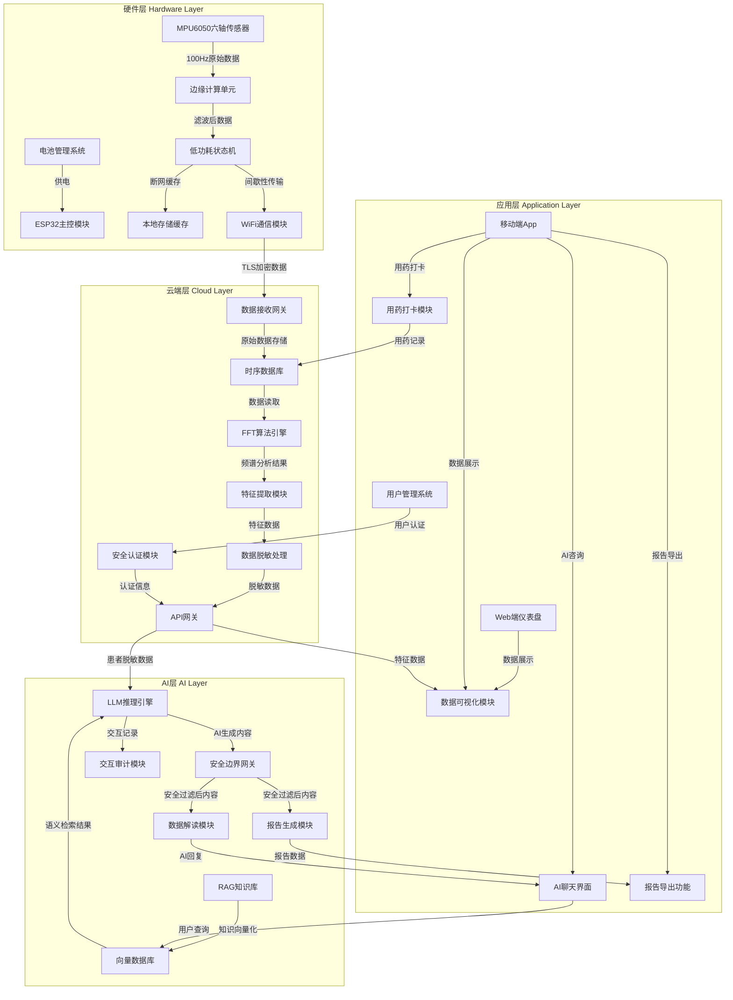

# 震颤卫士（Tremor Guard）系统架构设计图

## 系统架构概述

本架构设计图展示了震颤卫士系统的四个核心层级：硬件层、云端层、AI层和应用层，以及它们之间的完整数据流向。

## 各层级详细说明

### 1. 硬件层（Hardware Layer）

**核心组件：**
- **ESP32主控模块**：负责整个硬件系统的控制和协调
- **MPU6050六轴传感器**：以100Hz的采样率采集患者腕部的三维运动学数据
- **边缘计算单元**：对原始数据进行带通滤波和噪声抑制预处理
- **低功耗状态机**：管理设备的活跃监测和深度休眠状态，优化电池续航
- **本地存储缓存**：在断网情况下存储至少72小时的原始特征数据
- **WiFi通信模块**：采用TLS加密进行间歇性数据传输
- **电池管理系统**：确保500mAh电池在典型使用场景下续航超过7天

**数据流程：**
1. MPU6050采集100Hz原始数据
2. 边缘计算单元进行滤波处理
3. 低功耗状态机根据运动情况调整设备状态
4. 数据通过WiFi模块以TLS加密方式传输到云端
5. 断网时数据暂存到本地存储缓存

### 2. 云端层（Cloud Layer）

**核心组件：**
- **数据接收网关**：接收来自硬件层的加密数据
- **时序数据库**：存储高并发的时序数据
- **FFT算法引擎**：对数据进行快速傅里叶变换，识别4-6Hz的帕金森震颤特征
- **特征提取模块**：提取震颤事件的特征参数（频率、持续时间、幅度等）
- **数据脱敏处理**：对患者数据进行去标识化处理，确保隐私安全
- **API网关**：提供安全的API接口，连接云端与AI层、应用层
- **安全认证模块**：管理用户认证和访问控制

**数据流程：**
1. 数据接收网关接收硬件传输的数据
2. 原始数据存储到时序数据库
3. FFT算法引擎对数据进行频谱分析
4. 特征提取模块提取震颤特征参数
5. 数据脱敏处理确保数据隐私
6. 通过API网关将处理后的数据传输到AI层和应用层

### 3. AI层（AI Layer）

**核心组件：**
- **RAG知识库**：存储权威医学知识库，如《中国帕金森病治疗指南》等
- **向量数据库**：存储知识库的向量化表示，支持语义相似度检索
- **LLM推理引擎**：基于大语言模型进行推理和生成
- **安全边界网关**：确保AI输出符合医疗安全边界，禁止诊断和处方建议
- **数据解读模块**：将专业医学数据转化为通俗易懂的健康建议
- **报告生成模块**：生成结构化的PDF数据摘要报告
- **交互审计模块**：记录所有AI交互，确保合规性

**数据流程：**
1. RAG知识库内容向量化存储到向量数据库
2. 用户查询通过向量数据库进行语义检索
3. LLM推理引擎结合检索结果和患者数据生成回复
4. 安全边界网关过滤不安全内容
5. 数据解读模块将专业数据转化为通俗语言
6. 报告生成模块生成结构化报告
7. 交互审计模块记录所有交互过程

### 4. 应用层（Application Layer）

**核心组件：**
- **Web端仪表盘**：展示患者震颤数据和趋势图表
- **移动端App**：提供便捷的用户交互界面
- **AI聊天界面**：实现与AI医生的自然语言交互
- **数据可视化模块**：将震颤数据转化为直观的图表
- **用药打卡模块**：记录患者服药时间，与震颤数据关联
- **报告导出功能**：导出PDF格式的震颤分析报告
- **用户管理系统**：管理用户账号和权限

**数据流程：**
1. 用户通过移动端App进行用药打卡
2. 用药记录存储到云端时序数据库
3. 数据可视化模块从云端获取特征数据并展示
4. 用户通过AI聊天界面与AI医生交互
5. AI回复通过数据解读模块生成并展示
6. 用户可以导出PDF格式的震颤分析报告

## 技术特点

1. **低功耗设计**：硬件层采用深度休眠模式，确保电池续航超过7天
2. **数据安全**：全链路TLS加密，数据脱敏处理，确保患者隐私安全
3. **精准识别**：基于FFT算法的震颤识别，准确率高
4. **智能分析**：结合RAG和LLM技术，提供专业的健康咨询
5. **用户友好**：直观的数据可视化和自然语言交互
6. **跨平台支持**：同时支持Web端和移动端

## 接口规范

| 层级间接口 | 数据传输协议 | 数据格式 | 安全措施 |
|-----------|------------|---------|----------|
| 硬件层 → 云端层 | TLS 1.3 | 加密JSON | 端到端加密 |
| 云端层 → AI层 | HTTPS | 脱敏JSON | API认证 |
| 云端层 → 应用层 | HTTPS | JSON | API认证 |
| AI层 → 应用层 | HTTPS | JSON/HTML | API认证 |
| 应用层 → 云端层 | HTTPS | JSON | API认证 |

## 职责边界

| 团队 | 负责层级 | 核心职责 |
|-----|---------|----------|
| 硬件开发团队 | 硬件层 | 传感器选型、电路设计、低功耗优化、数据采集与传输 |
| 后端开发团队 | 云端层 | 数据接收、存储、处理、算法实现、API开发 |
| AI开发团队 | AI层 | 知识库构建、向量数据库管理、LLM集成、安全边界设计 |
| 前端开发团队 | 应用层 | Web端仪表盘、移动端App、数据可视化、用户交互设计 |

此架构设计图旨在帮助不同分工的学生团队明确各层级间的接口规范、数据交互方式及职责边界，促进跨团队协作与开发对接。