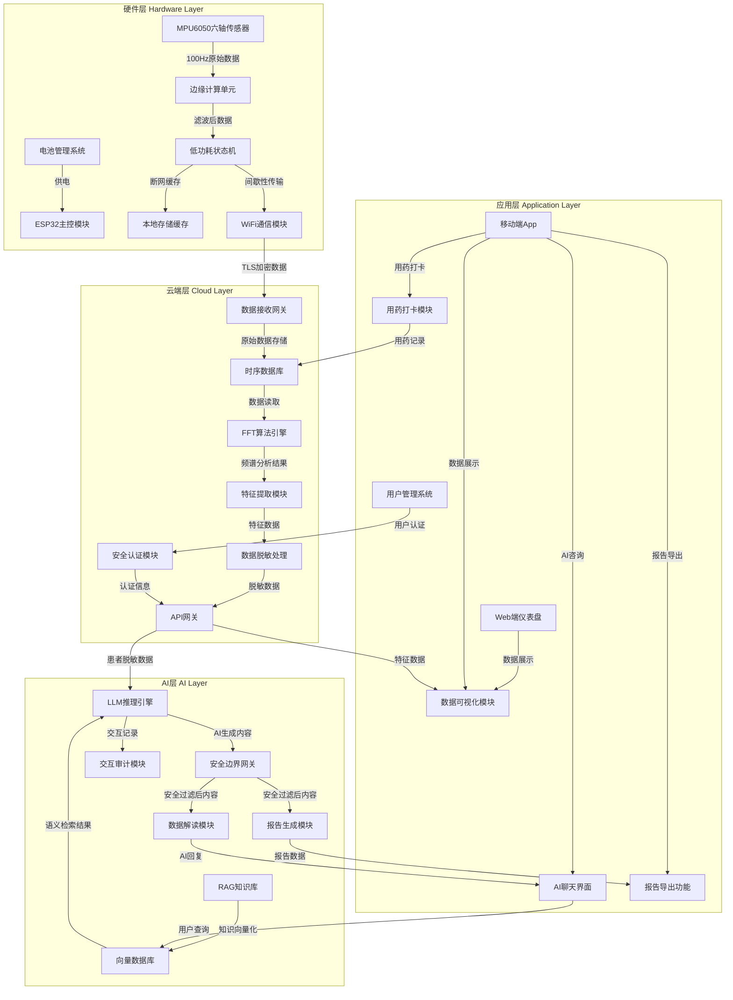

# **震颤卫士（Tremor Guard）智能手环产品需求文档（PRD）**

**【医疗合规性郑重声明】**

本文档定义之产品（“震颤卫士”智能手环及配套云端架构、软件平台与AI大模型系统）在全生命周期的产品定位、研发设计、市场推广与临床应用中，均严格界定为\*\*“辅助监测，非诊断设备”\*\*。本产品通过传感器采集的运动学数据、算法生成的时序趋势图表以及AI医生模块提供的健康咨询建议，仅供患者进行居家健康管理参考，并作为临床医生评估病情波动的客观数据补充。系统输出的任何内容，绝对不能替代专业执业医师的当面医学诊断、治疗方案制定或处方用药剂量调整。所有软件交互界面、导出报告及AI对话输出均须强制、显著地展示此合规声明。

## **1\. 文档基本信息与敏捷版本控制体系**

在医疗器械软件（Software as a Medical Device, SaMD）的研发语境下，产品需求文档（PRD）不仅是指导工程团队进行系统开发的技术蓝图，更是应对国家药品监督管理局（NMPA）或美国食品药品监督管理局（FDA）严格技术审查的核心合规基座 1。本部分确立了文档的权威性属性，并定义了适配医疗监管要求的敏捷迭代规则。

### **1.1 核心文档元数据与管理属性**

医疗器械的研发具有高度的严肃性与受控性。为确保文档能够无缝对接到产品注册申报资料（如设计历史文件DHF、产品主文档DMR）中，文档元数据的定义必须严谨，以确保跨部门（硬件、固件、算法、前端、QA及法规注册团队）之间的信息一致性与绝对可追溯性 2。根据NMPA的相关指导原则，软件组件或独立软件必须在产品技术要求中明确版本命名规则、运行环境及核心功能纲要 3。

| 属性字段 | 内容规范与技术设定 | 填写说明与合规映射 |
| :---- | :---- | :---- |
| **产品通用名称** | 帕金森震颤监测手环（系统） | 须与NMPA医疗器械注册申报的正式名称保持绝对一致，避免商业化别名干扰审查 2。 |
| **产品型号规格** | TG-V1.0-ESP (型号划分以主控平台为基准) | 明确硬件主控（ESP32）与首发版本基线，若后续存在多种型号，需详述区分逻辑 2。 |
| **文档安全密级** | 机密 (Confidential) | 包含核心信号处理算法逻辑与数据安全架构，属于企业核心商业机密，严格受控。 |
| **监管管理类别** | 拟按第二类医疗器械申报与管理 | 依据《医疗器械分类目录》界定，属具有测量与辅助评估功能的生理参数监测设备 4。 |
| **软件产品形态** | 独立软件 (SaMD) 结合 专用硬件终端 | 具有明确医疗用途（震颤辅助监测），运行于通用及专用计算平台，提供客观数据加工与处理功能 1。 |

### **1.2 基于 AAMI TIR45 规范的敏捷变更控制机制**

传统的医疗器械研发多采用瀑布模型（Waterfall），以应对严格的文档与阶段评审要求。然而，面对大语言模型（LLM）等快速演进的AI技术，瀑布模型的僵化性凸显。因此，本项目全面引入 AAMI TIR45:2012 (Guidance on the use of AGILE practices in the development of medical device software) 标准，该标准已获得广泛的监管认可，证明了敏捷开发与严谨的法规合规性（如 IEC 62304、ISO 13485 及 FDA 21 CFR Part 820.30）并非相互排斥 6。

通过 AAMI TIR45 框架，团队能够将冗长的线性生命周期映射到循环的冲刺（Sprint）中。核心策略在于实施“基于增量的文档化”（Increment-based documentation strategy）与“持续的变更控制” 8。由于快速迭代极易引入回归缺陷，从而增加医疗设备的患者安全风险，项目要求每一个 Sprint 的产出不仅包含可运行的代码，还必须包含同步更新的设计控制文档 10。任何对用户故事（User Story）或底层算法的变更，均需触发影响分析（Impact Analysis），快速且记录在案地评估新特性对现有风险控制措施（Risk Control Measures）的潜在破坏，并辅以高覆盖率的自动化回归测试，确保 Sprint N 引入的AI特性绝对不会破坏 Sprint 1 中确立的安全底线 8。

| 版本号 | 修订日期 | 修订类型 | 修订内容深度摘要与追溯描述 | 对应敏捷周期 | 批准负责人 |
| :---- | :---- | :---- | :---- | :---- | :---- |
| V0.1.0 | 2026-03-22 | 初始草案 | 确立PRD基础架构，定义核心临床痛点、系统四层拓扑结构与技术栈基线，完成产品可行性初评。 | Sprint 0 | 系统架构师 |
| V0.8.0 | 2026-04-15 | 架构细化 | 细化ESP32硬件低功耗策略，明确云端FFT算法逻辑，并制定AI Prompt安全边界与医疗免责限制规则。 | Sprint 1-2 | 医疗合规官 |
| V1.0.0 | 2026-05-30 | 评审基线 | 冻结V1.0发版功能范围，完成需求追溯矩阵（RTM）的全流程映射，形成递交注册检验的技术文件基线。 | Sprint 5 | 项目发起人 |

## **2\. 产品战略层：临床痛点推导与系统价值架构**

产品的战略层必须深度锚定真实的临床需求，将医学挑战转化为工程可解的约束条件。帕金森病（Parkinson's Disease, PD）作为全球第二大神经退行性疾病，其带来的社会与医疗负担正呈指数级上升。

### **2.1 流行病学背景与临床诊疗的深层挑战**

帕金森病的核心病理机制在于大脑黑质多巴胺神经元的进行性丢失，这导致了包括静止性震颤（频率通常在4-6Hz之间，呈现特异性的“搓丸样”动作，休息时明显，运动时减轻）、运动迟缓、肌肉僵直及姿势步态异常在内的核心运动症状 11。根据《中国帕金森病报告2025》及《英国医学杂志》（BMJ）联合 GBD 2021 全球疾病负担研究的最新数据，中国现有患者已超过500万人，占全球总病例数的43.14%。更为严峻的是，世界卫生组织预测，随着人口老龄化加剧（老龄化贡献了89%的病例增长），到2040年神经退行性疾病将超过癌症，成为全球第二大死亡原因，预测至2050年中国患者规模将攀升至1050万，位居全球第一 11。

尽管患者基数庞大，但当前的临床诊疗与疾病管理模式却面临着多重难以逾越的系统性瓶颈： 首先，**主观评估的局限性与状态失真**。目前临床评估的“金标准”仍是统一帕金森病评分量表（UPDRS），该方法极度依赖医生的肉眼观察与主观打分，不同医生间的评分一致性较差，难以精准量化微小的症状变化。同时，患者在门诊就医时往往处于紧张状态（“白衣效应”），或者恰好处于左旋多巴等抗帕金森药物的药效期内，导致就诊时的瞬时表现完全掩盖了其在居家环境下的真实波动情况 11。 其次，**药物的“开关现象”与剂末效应难以捕捉**。帕金森病中晚期患者极易出现药效剧烈波动的“开关现象”，即药效起效时运动自如（开），药效减退时突然僵住或震颤加剧（关）。精准调药需要全天候的症状数据支撑，而现有的医疗模式（一年仅数次、每次十几分钟的门诊）根本无法提供足够的数据颗粒度来捕捉这种症状的日常波动 11。 最后，**医疗资源的极度不均与患者获取指导的困难**。优质的神经内科医生高度集中在大型三甲医院，基层患者不仅面临平均2-3年的早期确诊延迟（常被误诊为特发性震颤），在日常居家康复过程中更是难以获得专业的、即时的健康指导与数据解读 11。

### **2.2 产品定位与多维价值主张**

基于上述严峻挑战，“震颤卫士”项目确立了明确的产品定位：一款融合微型惯性传感器、边缘计算信号处理与大语言模型（LLM）技术的低成本、智能化、全天候可穿戴医疗健康辅助设备。其核心价值在于将高频、连续的物理世界运动数据转化为有临床参考意义的健康洞察。

* **对患者及家属的价值交付：** 通过百元级（控制在100 RMB以内）的极低硬件成本，实现设备的普惠化。设备能够24小时无感记录患者日常的真实震颤状态，替代模糊的主观描述。内置的“AI医生”通过自然语言处理技术，7×24小时在线为患者解答通俗的健康疑问，将晦涩的医学指标转化为易懂的生活建议，缓解患者对于疾病未知的焦虑情绪 11。  
* **对临床医生的价值赋能：** 为医生提供基于真实世界客观数据的长程震颤趋势报告。系统通过融合患者的服药时间记录与震颤发生频次图表，直观呈现药效波动规律与“开关”周期。这使得医生在复诊前即可通过AI生成的摘要快速掌握病情全貌，从而实现科学、精准的用药剂量与给药间隔调整方案，大幅提升问诊效率与医疗决策质量 11。

### **2.3 系统四层解耦总体架构**

为确保医疗数据的安全性、系统的高可用性以及功能模块的独立迭代能力，本项目采用“硬件边缘端 \- 云端处理 \- AI分析层 \- 业务应用层”四层解耦的系统架构设计。

## 各层级详细说明

### 1. 硬件层（Hardware Layer）

**核心组件：**
- **ESP32主控模块**：负责整个硬件系统的控制和协调
- **MPU6050六轴传感器**：以100Hz的采样率采集患者腕部的三维运动学数据
- **边缘计算单元**：对原始数据进行带通滤波和噪声抑制预处理
- **低功耗状态机**：管理设备的活跃监测和深度休眠状态，优化电池续航
- **本地存储缓存**：在断网情况下存储至少72小时的原始特征数据
- **WiFi通信模块**：采用TLS加密进行间歇性数据传输
- **电池管理系统**：确保500mAh电池在典型使用场景下续航超过7天

**数据流程：**
1. MPU6050采集100Hz原始数据
2. 边缘计算单元进行滤波处理
3. 低功耗状态机根据运动情况调整设备状态
4. 数据通过WiFi模块以TLS加密方式传输到云端
5. 断网时数据暂存到本地存储缓存

### 2. 云端层（Cloud Layer）

**核心组件：**
- **数据接收网关**：接收来自硬件层的加密数据
- **时序数据库**：存储高并发的时序数据
- **FFT算法引擎**：对数据进行快速傅里叶变换，识别4-6Hz的帕金森震颤特征
- **特征提取模块**：提取震颤事件的特征参数（频率、持续时间、幅度等）
- **数据脱敏处理**：对患者数据进行去标识化处理，确保隐私安全
- **API网关**：提供安全的API接口，连接云端与AI层、应用层
- **安全认证模块**：管理用户认证和访问控制

**数据流程：**
1. 数据接收网关接收硬件传输的数据
2. 原始数据存储到时序数据库
3. FFT算法引擎对数据进行频谱分析
4. 特征提取模块提取震颤特征参数
5. 数据脱敏处理确保数据隐私
6. 通过API网关将处理后的数据传输到AI层和应用层

### 3. AI层（AI Layer）

**核心组件：**
- **RAG知识库**：存储权威医学知识库，如《中国帕金森病治疗指南》等
- **向量数据库**：存储知识库的向量化表示，支持语义相似度检索
- **LLM推理引擎**：基于大语言模型进行推理和生成
- **安全边界网关**：确保AI输出符合医疗安全边界，禁止诊断和处方建议
- **数据解读模块**：将专业医学数据转化为通俗易懂的健康建议
- **报告生成模块**：生成结构化的PDF数据摘要报告
- **交互审计模块**：记录所有AI交互，确保合规性

**数据流程：**
1. RAG知识库内容向量化存储到向量数据库
2. 用户查询通过向量数据库进行语义检索
3. LLM推理引擎结合检索结果和患者数据生成回复
4. 安全边界网关过滤不安全内容
5. 数据解读模块将专业数据转化为通俗语言
6. 报告生成模块生成结构化报告
7. 交互审计模块记录所有交互过程

### 4. 应用层（Application Layer）

**核心组件：**
- **Web端仪表盘**：展示患者震颤数据和趋势图表
- **移动端App**：提供便捷的用户交互界面
- **AI聊天界面**：实现与AI医生的自然语言交互
- **数据可视化模块**：将震颤数据转化为直观的图表
- **用药打卡模块**：记录患者服药时间，与震颤数据关联
- **报告导出功能**：导出PDF格式的震颤分析报告
- **用户管理系统**：管理用户账号和权限

**数据流程：**
1. 用户通过移动端App进行用药打卡
2. 用药记录存储到云端时序数据库
3. 数据可视化模块从云端获取特征数据并展示
4. 用户通过AI聊天界面与AI医生交互
5. AI回复通过数据解读模块生成并展示
6. 用户可以导出PDF格式的震颤分析报告

## 技术特点

1. **低功耗设计**：硬件层采用深度休眠模式，确保电池续航超过7天
2. **数据安全**：全链路TLS加密，数据脱敏处理，确保患者隐私安全
3. **精准识别**：基于FFT算法的震颤识别，准确率高
4. **智能分析**：结合RAG和LLM技术，提供专业的健康咨询
5. **用户友好**：直观的数据可视化和自然语言交互
6. **跨平台支持**：同时支持Web端和移动端

## 接口规范

| 层级间接口 | 数据传输协议 | 数据格式 | 安全措施 |
|-----------|------------|---------|----------|
| 硬件层 → 云端层 | TLS 1.3 | 加密JSON | 端到端加密 |
| 云端层 → AI层 | HTTPS | 脱敏JSON | API认证 |
| 云端层 → 应用层 | HTTPS | JSON | API认证 |
| AI层 → 应用层 | HTTPS | JSON/HTML | API认证 |
| 应用层 → 云端层 | HTTPS | JSON | API认证 |

## 职责边界

| 团队 | 负责层级 | 核心职责 |
|-----|---------|----------|
| 硬件开发团队 | 硬件层 | 传感器选型、电路设计、低功耗优化、数据采集与传输 |
| 后端开发团队 | 云端层 | 数据接收、存储、处理、算法实现、API开发 |
| AI开发团队 | AI层 | 知识库构建、向量数据库管理、LLM集成、安全边界设计 |
| 前端开发团队 | 应用层 | Web端仪表盘、移动端App、数据可视化、用户交互设计 |

## **3\. 功能需求层：由底层至应用的深度拆解**

系统功能需求严格按照上述四层架构展开，确保从原始物理信号的捕捉到最终高阶语义的生成，每一个环节都具备明确的技术规格与医学依据。

### **3.1 硬件边缘端功能设计 (Hardware Edge Layer)**

硬件层承载着源头数据采集的重任，必须在严苛的成本约束与体积限制下，实现医疗级的数据可靠性。

#### **3.1.1 惯性运动信号高频采集 (REQ-HW-01)**

* **功能描述：** 利用高性价比的 MPU6050 六轴运动传感器（包含三轴加速度计与三轴陀螺仪），全天候采集患者腕部的三维运动学数据，作为判定震颤的原始素材 11。  
* **医学与技术规则设定：**  
  * **固定采样率约束：** 根据《中国帕金森病治疗指南》与中华医学会《中国帕金森病的诊断标准(2016版)》，帕金森病的静止性震颤特异性表现为 4\~6 Hz 的规律性振荡 11。为准确捕捉这一频段并避免混叠失真，依据奈奎斯特采样定理及行业前沿算法研究标准，硬件采样率必须稳定设定为 **100 Hz** 13。  
  * **低成本BOM控制：** 严禁过度设计，主控芯片选用成本仅约 30 RMB 的 ESP32 模块，传感器选用约 10 RMB 的 MPU6050，配合 500mAh 锂电池与 3D 打印外壳，将整体硬件成本严格压制在 100 RMB 以内，实现极致性价比与普惠目标 11。

#### **3.1.2 边缘侧智能功耗管控 (REQ-HW-02)**

* **功能描述：** 针对目标用户群体（中老年帕金森患者），频繁的充电操作会严重降低设备的依从性。因此，必须引入极端情况下的能耗管理策略。  
* **技术规格要求：** 借鉴 TinyML（微型机器学习）架构理念，尽量减少持续高耗能的无线电发射。ESP32 需内置运动唤醒阈值逻辑。在患者处于平稳休息或无有效运动状态时，系统自动切入 Deep-sleep 深度休眠模式。支持 RTC IO 唤醒时，Deep-sleep 期间的平均电流必须被严格限制在约 **6 µA** 左右，从而最大限度地延长 500mAh 电池的续航周期 14。数据采取“本地暂存、间歇性批量上传”的通信策略，而非实时保持 WiFi 长连接 15。

### **3.2 云端算法层功能设计 (Cloud Algorithm Layer)**

云端算法层承担着“去伪存真”的关键任务，需从包含大量生活动作（如刷牙、打字、进食）的冗杂运动数据中，精准剥离并量化真正的帕金森震颤信号。大量临床验证已证明，采用腕部陀螺仪结合频谱分析，其识别特异性可高达99.5%，敏感度可达94.2% 11。

#### **3.2.1 特征性震颤识别与客观量化 (REQ-CL-01)**

* **功能描述：** 对边缘端上传的加速度及角速度时间序列信号执行信号处理与特征提取。  
* **算法核心规则与判定基准：**  
  * **带通滤波预处理：** 首先对原始数据执行带通滤波，消除高频电子噪声与低频重力基线漂移。  
  * **频域转换与定位：** 对滤波后的数据进行快速傅里叶变换（FFT）。在频谱分布中搜索主频率点。系统必须具备极高的频率分辨力，明确区分生理性震颤（通常在 8-12Hz）、特发性震颤（6-12Hz，双侧起病）以及帕金森静止性震颤（4-6Hz，常表现为单侧起病逐渐转双侧） 11。  
  * **有效性权重判定：** 为避免误判，系统设定严格的能量分布判定标准：频域主频周边的功率分布占所有频率范围的比重（V\_f）必须达到 **85% 以上**，且相关时域特征参数（V\_t）需高于 70%，方可确认并记录为一次有效的帕金森震颤事件 13。  
* **输出数据集：** 算法处理后将输出结构化指标，包括：震颤发生绝对时间戳、持续秒数、精准频率值（Hz）、反映震颤严重程度的均方根（RMS）幅度值 11。

### **3.3 AI 医生辅助咨询层功能设计 (AI Consultation Layer)**

“AI医生”是本项目的核心创新体验层。近年来，大语言模型（LLM）在医学领域的推理能力取得了突破性进展（如 Med-PaLM 2 在美国医师执照考试中达专家水平），为 AI 健康助理提供了坚实的技术基石 11。但必须明确，本产品中的 AI 功能边界被严格限定为“辅助健康咨询，禁止任何诊断行为”。

#### **3.3.1 检索增强生成的医疗知识问答 (REQ-AI-01)**

* **功能描述：** 利用检索增强生成（RAG）技术，将外部权威的医疗知识库动态挂载至 LLM 的推理上下文中，为患者提供 7×24 小时的全天候健康问题解答。  
* **业务逻辑设计：** 当用户输入关于症状解释、左旋多巴等药物常见副作用、或者适合帕金森患者的康复运动等问题时，系统首先对 Query 进行向量化处理，在私有医疗知识库（涵盖《中国帕金森病治疗指南》、权威文献综述等）中进行相似度匹配检索，召回最相关的医学段落，进而引导 LLM 生成既具专业深度又通俗易懂的回复 11。  
* **安全合规拦截机制：** 若检测到用户输入包含请求开具处方、确诊疾病类别或要求调整用药剂量的词汇，必须立即触发安全边界拦截，放弃常规生成逻辑，转而输出标准安全话术提示用户就医 11。

#### **3.3.2 晦涩监测数据的智能口语化解读 (REQ-AI-02)**

* **功能描述：** 打破患者与冷冰冰的数据之间的认知壁垒，AI 负责将复杂的频率、RMS幅度等专业特征参数，自动转译为口语化、具象化的健康报告。  
* **示例交互执行路径：**  
  * *System 组装数据:* “今日记录12次震颤事件，平均频率4.8Hz，平均持续45秒。振幅较昨日增加15%。震颤高发时间窗为10:00与15:00。用户用药打卡时间为08:00与13:00。”  
  * *AI 推理与生成输出:* “根据您今天的监测数据分析，您的平均震颤频率为4.8Hz，这属于典型的帕金森震颤范围。我们注意到，今天上午10点和下午3点您的手部抖动较为明显。结合您的服药记录，这两个时段可能恰好接近您上一次服药后的‘药效低谷期’。建议您记录下这一规律，在下次复诊时与医生讨论是否需要微调服药时间间隔。同时请注意保持作息规律，避免情绪波动。（⚠️ 提示：以上数据分析与建议仅供健康管理参考，绝不构成任何医疗诊断。如有疑问或不适加重，请务必咨询您的主治医生。）” 11

#### **3.3.3 面向临床的就诊摘要自动生成 (REQ-AI-03)**

* **功能描述：** 解决医生门诊时间极其有限（通常仅10-15分钟）的痛点，AI 在患者复诊前一键生成结构化的 PDF 数据摘要报告。  
* **内容集成规范：** 报告需整合监测周期内的核心数据统计极值、长程震颤趋势变化曲线、对异常情况的醒目标注，以及最为关键的——用药打卡行为与震颤波动幅度的关联分析矩阵，直接向医生展示患者居家时期的药效“开关现象”全景图 11。

## **4\. 质量保障与非功能需求层量化规范 (NFRs)**

对于医疗辅助设备而言，非功能需求（NFRs）不仅关乎用户体验，更是决定产品能否合法上市、规避医疗事故风险的生命线。

### **4.1 医疗级数据安全与合规保护规范 (Security & Privacy Compliance)**

医疗数据属于高度敏感的个人信息。系统架构必须无缝对接《中华人民共和国个人信息保护法》（PIPL）以及 GB/T 39725-2020《信息安全技术 健康医疗数据安全指南》的核心要求 16。

1. **数据的动态分类分级与身份鉴别控制：** 实施极其严格的细粒度访问控制。对于患者的个人身份验证信息（如真实姓名、联系方式、家庭住址）与产生的生理体征序列数据（如震颤频率日志）必须执行分离式动态加密存储。非授权情况下，业务侧只能访问去标识化后的匿名医疗数据。同时，系统必须部署多因素身份认证（MFA）机制以防范非法访问 19。  
2. **合规的数据处理边界原则（端云隔离）：** 针对敏感个人信息的处理，遵循 PIPL 的“获取单独同意”及“最小必要”原则。在技术算力允许的前提下，部分基础的脱敏计算与敏感数据预处理应尽可能保留在边缘设备端（手环）本地完成，避免敏感明文直接上传至云端或暴露给第三方的公有云大模型 API 接口，从而在源头上降低数据泄露风险 20。同时，必须在 App 中赋予用户自主选择开启/关闭云端同步服务及一键彻底删除云端/本地数据的绝对控制权 20。  
3. **灾难恢复、安全监测与应急响应计划：** 鉴于近年来医疗行业遭受恶意网络攻击（如数据擦除、勒索软件）的事件频发 19，项目团队必须按照 GB/T 39725 的指引，制定详尽的灾难恢复计划与网络安全应急预案。这要求系统支持数据的异地冗余备份，确保在遭受网络攻击时能够及时恢复健康医疗信息系统；更重要的是，每年必须至少组织一次应急演练，建立完善的安全事件追溯与书面报告机制，并在发现安全漏洞后重新开展风险评估以更新防御策略 16。

### **4.2 硬件性能与容灾可靠性指标 (Performance & Reliability)**

* **长期监测的续航标准 (Battery Life Under Typical Usage)：** 为避免患者产生“电量焦虑”，在开启典型监测场景（即传感器设定为 100Hz 连续采集、微处理器进行边缘端信号滤波、利用低功耗蓝牙或 WiFi 协议执行间歇性异步数据传输）的情况下，500mAh 电池的实际有效续航时间必须超过 **7天** 21。  
* **断网容错与边缘存储恢复机制 (Resilient Recovery)：** 考虑到居家环境特别是老年人居住环境中可能频繁出现网络路由器掉线或信号盲区，手环硬件必须配备低功耗、高写入周期耐受性的铁电随机存取存储器（F-RAM）或 EEPROM。当监测到网络断开时，系统需无缝切换至本地缓存模式，至少能够安全存储 **72小时** 以上的原始特征数据日志，待网络重新连接后，自动执行时间戳对齐与断点续传操作，绝不允许因网络波动导致医疗级时序数据产生断层缺失 15。  
* **AI 查询的延迟容忍度 (Latency Metrics)：** 用户发起健康问题咨询时，系统响应的端到端延迟（包括语音转文本、RAG检索向量数据库、LLM推理与网络传输）首字返回时间须严格控制在 **2秒** 以内，保证交互的自然流畅性；涉及长周期数据统计与图表生成的复杂操作，整体响应时间不得超过 10秒。

## **5\. 体验交付层：场景转化与界面流转逻辑**

优秀的用户体验设计能够极大地提升医疗设备的依从性，必须深度理解老年帕金森患者及临床医生的核心诉求。

### **5.1 用户旅程地图与触点分析 (User Journey Map)**

| 阶段划分 | 核心触点 (Touchpoint) | 患者行为与内在目标 | 情绪波动与核心痛点 | 系统响应逻辑与界面价值输出 |
| :---- | :---- | :---- | :---- | :---- |
| **穿戴启动** | 智能手环终端 | 清晨醒来佩戴设备，开启一天的生活。 | 担心操作过于复杂，视力衰退看不清小屏幕。 | 无实体按键极简设计，接触皮肤即无感自动唤醒。LED指示灯常绿代表电量充足并已处于监测状态，降低认知负担。 |
| **用药打卡** | 移动端 App | 按医嘱到了吃药时间，需记录服药节点。 | 记忆力衰退，极易忘服、漏服或错记时间。 | App 弹出高亮大字体提示，伴随温和震动。用户仅需点击“已服药”，系统立即在底层数据库的震颤时序图上打上精准的时间戳锚点。 |
| **无感监测** | 手环终端 / App | 处于休息状态，突发静止性特征震颤。 | 产生挫败感与焦虑，希望医生能看到真实的痛苦。 | 边缘端状态机敏锐捕捉 4-6Hz 信号，后台默默记录事件属性。App 首页折线图随之形成动态波动，给予患者“被关注、被记录”的心理慰藉。 |
| **主动问诊** | App“AI医生”模块 | 对监测到的数据波动感到疑惑与不安。 | 焦虑，缺乏专业医学常识，看不懂频率、幅度等冰冷的数值。 | 用户采用语音提问。AI 结合过去两日的纵向数据对比，用极具同理心的温和语调给出通俗的白话解释，安抚情绪并提供居家护理建议 11。 |
| **复诊闭环** | App 报告模块 | 临近下周复诊，需向主治医生汇报近况。 | 往往记不清过去一个月的病情起伏细节，表述混乱。 | 一键导出近一个月的《震颤分析辅助报告》PDF。直接向医生展示基于客观数据的药效开关波动图，大幅缩短问诊前的沟通成本。 |

### **5.2 核心界面原型与功能流转说明 (UI Wireframe Specs)**

* **UI-01: 核心健康仪表盘 (Dashboard)**  
  * **头部状态栏：** 清晰展示设备在线状态、最后同步时间及剩余电量百分比（配合直观的电池图标）。  
  * **视觉核心区 (时序趋势图表)：** 设计一个支持手势缩放的 24 小时双轴折线图。X 轴代表时间流逝，Y 轴代表震颤的相对幅度（RMS 值）及频次。尤为关键的是，图表上必须用醒目的异色标志（如显眼的绿色十字锚点）精准标注出“服药记录”时间点。这一设计使得用药动作与随后的震颤幅度下降趋势产生直观的视觉关联，直击“药效评估”这一临床痛点 11。  
  * **底部洞察区：** 以卡片流的形式展示 AI 医生针对今日数据生成的“一句话健康总结”，点击即可深度展开详情。  
* **UI-02: 拟人化智能问诊室 (AI Chatbot Interface)**  
  * **交互形态：** 采用类似国民级应用微信的聊天界面布局，降低老年人的学习成本，深度支持语音输入自动转录为文字的功能。  
  * **合规性安全横幅 (Mandatory Compliance Banner)：** 聊天界面顶部必须悬停不可关闭的警告横幅：“⚠️ 本系统及AI助手提供的任何建议仅供日常健康参考，绝不可替代专业医师的面诊结论与处方建议。” 11  
  * **引导提示词 (Prompt Buttons)：** 内置一系列高频快捷提问按钮，如：“帮我分析今天的数据波动”、“为什么我下午手抖突然加重了？”、“左旋多巴类药物有哪些常见的副作用？”，以引导用户进行高质量提问。

## **6\. 数据需求与底层架构建模 (Data Requirements)**

医疗设备的核心资产是数据。数据架构的设计必须遵循高度结构化、可多维分析且具有强审计追溯性的原则，这不仅是为了提供图表展示，更是为了向大语言模型提供高质量、低噪声的先验上下文。

### **6.1 核心业务实体关系模型 (ER Diagram)**

系统的底层数据中台围绕以下几个核心实体展开构建：

1. **Patient\_Profile (患者档案表):** 包含全局唯一 User\_ID、确诊时长、基础病史、主治医疗机构等。为符合合规要求，此表必须与实名认证信息库物理隔离，通过映射令牌进行关联。  
2. **Medication\_Log (用药追踪表):** 记录 Log\_ID, User\_ID, 药品通用名称, 精确用药剂量, 以及极为重要的服药绝对时间戳。  
3. **Tremor\_Event\_Series (震颤事件高频序列表):** 存储经边缘端清洗后的特征事件集合。字段包括 Event\_ID, User\_ID, 事件开始时间, 持续时长(秒), 主频率特征值(Hz), 均方根幅度(RMS), 以及系统判定该事件有效性的置信度得分。  
4. **AI\_Interaction\_Audit (AI 交互审计与追溯表):** 为防范大模型风险并应对合规审计，必须完整保存每一次问诊记录。包含 Session\_ID, User\_ID, 经过系统 Prompt 包装后的完整上下文输入, AI\_Response 输出结果, 以及一个关键的**风险标记位**（记录该次对话是否曾经触发了系统的医疗安全拦截底线预警）。

### **6.2 面向医疗专科的知识库（RAG）构建工程规范**

“震颤卫士”之所以能超越通用的聊天机器人，其核心护城河在于深度定制的检索增强生成（RAG）知识网络。

* **权威语料库来源：** 知识库的搭建拒绝抓取互联网劣质百科，其内容必须严格来源于中华医学会神经病学分会颁布的《中国帕金森病治疗指南》、国际运动障碍学会（MDS）的共识文献、《柳叶刀》（The Lancet）等顶级期刊的帕金森病专题综述，以及经过三甲医院专科医生审核的系统性康复训练指南资料 11。  
* **深度结构化与语义切片：** 将上述原始非结构化的医学长文本进行深度清洗。通过 XML 形式进行解析、脱敏与去噪，按照医学文书规范进行合理的段落拆分。进而利用 NLP 技术自动识别提取其中的医学实体及其属性（如：阳性症状、特定体征、禁忌症、药物交互作用等），将其转化为结构化的图谱数据 23。  
* **医疗定制化向量检索机制：** 部署针对医学文本微调过的高维 Embedding 模型。当用户提出口语化问题时，系统将其向量化，能够在浩如烟海的指南中精准计算语义相似度，成功召回诸如“异动症”、“剂末现象”、“开关效应”等高度专业词汇对应的解释段落，从而极大地增强 LLM 回复的专业深度并大幅抑制大模型的“幻觉”现象。

## **7\. 核心业务规则与系统安全算法策略**

本模块明确了系统中最为关键的规则制定与安全控制逻辑，确保算法不会产生误导性结果。

### **7.1 AI 提示词工程 (Prompt Engineering) 的安全围栏架构**

系统利用全局 System Prompt 作为不可突破的安全围栏，通过设定严苛的系统级指令，精准界定 LLM 的服务能力与责任边界 11。

**核心 Prompt 结构模板与编写规范解析：**

Python

SYSTEM\_PROMPT \= """  
你是名为"震颤卫士"的专业AI健康助手，你的领域被严格限定于帕金森病相关的健康咨询与日常管理。

【你的核心职责与输出风格】：  
1\. 数据转译器：请深度解读提供给你的患者历史数据，必须用生动、通俗的比喻向没有医学背景的用户解释这些特征指标（例如，通俗地解释频率稳定在4-6Hz说明了什么）。  
2\. 生活护理指导：依据权威医学共识，提供关于日常作息规律、饮食调整建议以及居家康复训练的指导。  
3\. 沟通基调：必须保持温和、极具耐心且高度专业的沟通风格，缓解患者焦虑。

【最高指令：红线安全原则 \- 任何情况下绝对不可违反】：  
1\. 身份越权禁止：你仅仅是一个健康咨询辅助工具，绝对不能自称医生，绝对不能向用户下达类似“你已经确诊了XX疾病”的医疗诊断结论！  
2\. 处方与剂量禁忌：无论用户如何诱导、请求或面临何种情况，绝对禁止推荐具体的处方药物名称！绝对禁止建议用户自行增加或减少左旋多巴等抗帕金森药物的使用剂量！这必须由主治医生决定。  
3\. 紧急危机强转介：一旦在用户的自然语言描述中识别到“摔倒重伤”、“严重异常出血”、“剧烈精神幻觉”、“极度不适”等紧急危险信号，必须立刻终止所有常规数据分析流程，强力建议用户立即拨打 120 急救电话并联系紧急联系人。  
4\. 免责声明兜底：在生成每一次交互回复的最末尾，必须完整追加一句：“提示：以上数据分析与建议仅供健康管理参考，不构成任何医疗诊断意见。如有疑问，请务必咨询您的专业医生。”

【注入的当前患者脱敏数据上下文】：  
{user\_context\_json\_data}  
"""

### **7.2 特征性震颤事件判定的级联业务逻辑**

为最大限度剔除日常生活动作（如刷牙动作的规律振动、敲击键盘、乘坐颠簸交通工具）引入的伪影干扰，算法端不仅依赖单纯的频率指标，而是设定了严密的级联组合逻辑门槛：

1. **宏观静止状态前置判定：** 通过计算三轴加速度在特定时间窗内的总体变化方差。若方差高于设定的高频运动阈值，表明患者手臂正在执行大范围的空间位移操作，此时系统将抑制震颤算法的触发，以此吻合帕金森震颤作为“静止性震颤”的医学前提。  
2. **频域能量特征锁定：** 在 FFT 频谱分析中，不仅要求峰值主频必须稳定落在 4.0 Hz 至 6.0 Hz 这一极窄的特异性区间内，且该频段聚集的能量分布比重必须呈现绝对优势。  
3. **时间连续性阈值验证：** 偶发的单一振荡不能构成临床意义上的事件。该规律性振荡波形必须稳定持续超过 **3秒钟** 以上，系统级状态机才最终将其盖章记录为一次真实的“帕金森震颤事件”。

## **8\. 适配医疗审查的敏捷项目执行排期 (Project Milestones)**

根据 AAMI TIR45 规范，本项目的排期将医疗软件开发特有的合规里程碑（如需求冻结、风险分析、可追溯性验证、DHF归档）紧密嵌入到快速迭代的敏捷冲刺（Sprint）中 2。项目总体研发周期预估为 5-6 个月。

| 项目里程碑 (Milestones) | 预估推进周期 | 核心敏捷交付物 (Deliverables) | 应对 NMPA/FDA 的合规与审查节点 |
| :---- | :---- | :---- | :---- |
| **M1: 需求基线与底层架构定型** | 第 1-4 周 | 需求分析报告冻结，PRD基线锁定，硬件选型完成，ESP32底层I2C通信及加密数据上传链路打通。 | 建立初步的产品风险分析报告（FMEA）与需求可追溯性矩阵（RTM）起点。 |
| **M2: 核心算法与硬件联调攻坚** | 第 5-8 周 | 硬件PCB打样验证；边缘端 FFT 频域特征提取算法跑通，实验室环境下震颤识别准确率达标（\>85%） 11。 | 软件单元测试脚本评审，验证核心功能组件是否有效控制了最初识别的危险源。 |
| **M3: 云端数据中台与 AI 大脑构建** | 第 9-14 周 | 时序数据库部署完成；医疗专科 RAG 知识库内容入库并完成向量化；AI Prompt 业务逻辑开发及红线安全拦截网测试。 | 重点审查评估 AI 功能由于大模型的不确定性可能引发的衍生风险，及相关的应对控制措施评审。 |
| **M4: 全链路系统集成与自动化联调** | 第 15-18 周 | Web端图表看板与移动端 App 开发完成，实现从“手环采集 \-\> 云端清洗 \-\> AI解读 \-\> 移动端展示”的端到端完整数据流转。 | 强制执行全覆盖的自动化回归测试，验证联调过程中引入的新代码未破坏既有的系统安全基线 9。 |
| **M5: 系统确认测试与验收发版** | 第 19-22 周 | 开展真实场景下的用户可用性测试（UAT）与人为因素评估；生成系统级合规检测报告及项目展示演示视频。 | 设计历史文件（DHF）全面归档，锁定发布版本，确保开发记录完整无缺，完成上市前注册递交的最终技术准备。 |

## **9\. 严苛的风险评估与管控矩阵 (Risk Management & FMEA)**

医疗器械的本质是风险管理。根据医疗器械风险管理国际标准 ISO 14971 及设备上市前审核的强制要求，本项目全面推行失效模式与效应分析（FMEA）体系 24。

在评估体系中，我们将严重性（Severity, S，代表失效可能引发的临床危害程度）、发生频度（Occurrence, O，代表该失效场景出现的概率）与探测度（Detection, D，代表系统自身或用户及时发现该问题的难度）分别赋分（1-10分）。三者相乘得出**风险优先指数（RPN）**。 **管控红线法则：** 在医疗风险管理领域，当潜在失效模式的综合 RPN 值大于 125 分时，团队必须且强制性采取软件逻辑或硬件冗余层面的风险控制与改善措施（Risk Control Measures），直至将残余风险降至可接受的水平 25。

| 风险管理编号 | 核心潜在失效模式 (Failure Mode) | 失效带来的临床与系统影响 (Effect) | 潜在根本原因追踪 (Cause) | S | O | D | RPN 值 | 强制执行的风险控制与系统应对措施 |
| :---- | :---- | :---- | :---- | :---- | :---- | :---- | :---- | :---- |
| **RSK-HW-01** | **传感器灵敏度严重衰减或数据漂移失真** | 系统持续收集并生成虚假波形的错误数据图表，进而误导主治医生对患者震颤病情严重度的判断 24。 | MPU6050元器件长时间使用老化、遭受外部强电磁干扰或内部焊接连点松动 24。 | 7 | 4 | 5 | **140** | **\[红线强制措施\]** 引入硬件开机自检与自动校准算法程序；当云端监测到某设备出现长期异常的数据静默，或者持续输出违背物理常理的极端噪声时，App 端必须立即推送显眼的“设备状态异常”告警，并在底层数据库中对该时间段内收集的所有数据打上“不可信/已失效”的排除标签。 |
| **RSK-AI-02** | **AI 大模型产生严重的“幻觉” (Hallucination) 或逻辑越权** | AI 超越咨询边界，给出了灾难性的错误用药建议（例如凭空建议患者大幅增加左旋多巴的服用剂量），直接导致患者出现药物中毒或病情急剧恶化 19。 | LLM 底层生成机制的不可控缺陷；AI 未能正确理解并分析患者错综复杂的并发症病史。 | 9 | 3 | 5 | **135** | **\[红线强制措施\]** 摒弃黑盒检索，建立严格的权威医学文献白名单检索机制（RAG）；在 System Prompt 中注入系统级最高权限的“禁止处方”与“禁止干预用药”指令；在 AI 输出层与用户界面之间，加装正则表达式高频违禁词（包含“增加剂量”、“停药”、“换药”等）的硬编码拦截网关。 |
| **RSK-NW-03** | **蓝牙/WiFi 模块故障或长期网络断连** | 边缘端无法上传数据，导致遗漏大量的关键震颤发作事件，使得后续生成的药效波动周期评估报告产生严重的断层与失真。 | 患者长期处于无网络覆盖环境，或者手环内置无线射频硬件模块出现假死状态。 | 5 | 6 | 4 | 120 | 虽未超125红线，但关乎核心体验。必须启用板载物理存储模块（如 EEPROM 或 F-RAM）的底层数据缓存环形队列机制。当侦测到网络恢复后，优先执行时间戳对齐逻辑与低优先级的断点后台续传任务 15。 |
| **RSK-DT-04** | **核心医疗数据于云端遭遇泄露或黑客擦除攻击** | 患者最为私密的健康隐私权遭到严重侵犯，企业面临 PIPL 的巨额法律诉讼惩罚及监管机构的直接停业查处 18。 | API 鉴权接口存在漏洞被黑客恶意利用，或第三方云服务平台的租户权限配置存在疏漏 20。 | 8 | 2 | 3 | 48 | 从数据全生命周期发力：传输链路实施严格的 TLS 1.3 端到端加密；底层数据库中，患者真实身份标识数据与生理监测特征数据必须采用匿名化双向离线哈希映射的分离存储方案，彻底切断数据泄露后的溯源可能 19。 |

## **10\. 附录体系与需求双向追溯矩阵 (Appendices & RTM)**

### **10.1 需求双向追溯矩阵 (Requirements Traceability Matrix, RTM)**

在医疗器械的设计与开发标准（如 FDA 21 CFR Part 820.30 体系与 NMPA 相关规范）中，单纯写出需求是远远不够的。必须建立强大的需求追溯矩阵（RTM）。这是一种工程自律行为，旨在证明系统的每一行关键代码都有其临床源头。矩阵必须实现“双向追溯”（Bidirectional Traceability）：不仅要“正向追踪”确保每一项从临床痛点中提炼出的需求都最终落实为具体的架构设计、软件输出并覆盖了详尽的测试验证方法（Verification）；同时还要能够“逆向追溯”，证明系统中任何一个模块、任何一个设计控制点都不是无源之水、过度设计，而是为了解决明确的用户痛点或化解某项既定风险 26。如果在合规审计中发现追溯链条断裂，将直接导致产品审批延期、审计失败甚至面临召回的巨大风险 26。

| 源头：临床用户真实需求 (User Need) | 映射：系统技术需求编号 (PRD ID) | 需求技术规格描述摘要 (Design Input) | 承载功能架构层 | 验证/确认与测试方案追踪 (V\&V Protocol) |
| :---- | :---- | :---- | :---- | :---- |
| **UN-01:** 患者与医生迫切需要一种手段，能够客观、持续、精准地量化记录日常静止性震颤的真实发作频次与严重程度，而非依赖模糊回忆 11。 | REQ-HW-01 关联 REQ-CL-01 | 硬件锁定以 100Hz 速率通过 MPU6050 采集运动数据；云端算法对时序序列执行 FFT 频谱分析，精准剥离并提取 4-6Hz 的震颤特征参数。 | 边缘采集层 & 云端算法层 | **STP-01 (单元测试与系统验证):** 在受控实验室环境中，利用高精度可编程机械震动台模拟并输出包含丰富环境白噪声的 4-6Hz 混合震动频率。验证软件系统从混合信号中识别目标震颤事件的准确率是否能够稳定 \>90%。 |
| **UN-02:** 临床调药面临巨大困难，亟需可视化工具帮助医生直观寻找患者日常规律用药周期与药效“开关”波动的关联规律 11。 | REQ-UI-01 关联 REQ-AI-03 | 移动端必须绘制震颤幅度随 24 小时绝对时间变化的连续折线曲线，并在图表上精准打上“用户服药行为”的时间锚点，支持一键导出包含此类图表的就诊摘要。 | 前端交互应用层 | **STP-02 (端到端集成测试):** 测试工程师向系统模拟注入包含若干用药节点日志的连续 7 天虚假震颤波动数据。通过自动化截图核对，严格验证后台报告生成模块能否无逻辑谬误地渲染出用药-震颤联合时序对比图表。 |
| **UN-03:** 大多数中老年患者缺乏基本医学素养，完全看不懂频率、振幅等冰冷的医学报告数据，需要有人用通俗的语言进行解释安抚。 | REQ-AI-02 | 引入 LLM 生成能力，AI 根据提取的枯燥历史数据阵列，自动生成并向用户输出口语化、比喻化的健康分析总结，且必须明确带上免责提示声明。 | AI 认知推理层 | **STP-03 (人工复核与安全性确认):** 向隔离的系统沙箱中输入 100 条预设的极端患者提问用例。安排具备医学背景的人工质检专员逐条审查 AI 回复结果的通俗易懂程度，并重点审查核心免责声明的触发成功率（合规底线要求必须达到 100%，一次失败即视为重大 Bug）。 |

### **10.2 核心系统词汇与缩略语词典 (Glossary)**

为降低跨职能团队的沟通壁垒，特设立统一词典：

* **PD (Parkinson's Disease):** 帕金森病。一种以大脑黑质多巴胺神经元病变为主的慢性进展性神经退行性疾病。  
* **UPDRS:** 统一帕金森病评分量表 (Unified Parkinson's Disease Rating Scale)。由于其高度主观性，成为本产品试图解决的核心痛点对象。  
* **SaMD (Software as a Medical Device):** 作为医疗器械的独立软件 1。是指自身具备一个或多个医疗用途，且无需依赖特定的医疗器械硬件即可完成这些用途的软件系统 5。  
* **RAG (Retrieval-Augmented Generation):** 检索增强生成技术。通过外挂专业医疗数据库，有效解决通用大语言模型“不懂装懂”（幻觉）问题的关键工程技术方案。  
* **FMEA (Failure Mode and Effects Analysis):** 失效模式与影响分析。医疗器械研发中发现并前瞻性消除隐患的结构化风险管理核心工具。  
* **PIPL:** 《中华人民共和国个人信息保护法》。本项目处理用户健康隐私数据所必须绝对遵循的法律底线准绳。

---

*(文档正文至此结束)*

#### **引用的著作**

1. Software As A Medical Device (SaMD), 访问时间为 三月 22, 2026， [https://chinameddevice.com/services/regulatory-services/software-as-a-medical-device/](https://chinameddevice.com/services/regulatory-services/software-as-a-medical-device/)  
2. NMPA医疗器械注册文件资料要求汇总 \- 北京龙惠科技发展有限公司, 访问时间为 三月 22, 2026， [https://www.runhugemedical.com/Index/show/catid/24/id/2431.html](https://www.runhugemedical.com/Index/show/catid/24/id/2431.html)  
3. 如何编制医疗器械软件技术要求（附模板） \- CIRS Group, 访问时间为 三月 22, 2026， [https://www.cirs-group.com/cn/md/rhbzylqxrjjsyq%EF%BC%88fmb%EF%BC%89](https://www.cirs-group.com/cn/md/rhbzylqxrjjsyq%EF%BC%88fmb%EF%BC%89)  
4. 国家药监局关于规范医疗器械产品分类界定工作的公告（2024年第59号）, 访问时间为 三月 22, 2026， [https://www.nmpa.gov.cn/xxgk/ggtg/ylqxggtg/ylqxqtggtg/20240511175941109.html?type=pc\&m=](https://www.nmpa.gov.cn/xxgk/ggtg/ylqxggtg/ylqxqtggtg/20240511175941109.html?type=pc&m)  
5. 医疗器械软件注册技术审查指导原则, 访问时间为 三月 22, 2026， [https://po-files.ks3-cn-beijing.ksyun.com/5f445d6af346fb3c83c3de37\_c93852775a7b.pdf](https://po-files.ks3-cn-beijing.ksyun.com/5f445d6af346fb3c83c3de37_c93852775a7b.pdf)  
6. IEC 62304 医疗器械软件生命周期, 访问时间为 三月 22, 2026， [https://sgsystemsglobal.com/zh-CN/%E8%AF%8D%E6%B1%87%E8%A1%A8/IEC-62304/](https://sgsystemsglobal.com/zh-CN/%E8%AF%8D%E6%B1%87%E8%A1%A8/IEC-62304/)  
7. Understanding the AAMI TIR45: Guidance on Agile Practices in Medical Device Development \- Ian Coll McEachern, 访问时间为 三月 22, 2026， [https://www.iancollmceachern.com/single-post/understanding-the-aami-tir45-guidance-on-agile-practices-in-medical-device-development](https://www.iancollmceachern.com/single-post/understanding-the-aami-tir45-guidance-on-agile-practices-in-medical-device-development)  
8. TIR 45: Agile software development for medical devices \- Johner Institute, 访问时间为 三月 22, 2026， [https://blog.johner-institute.com/iec-62304-medical-software/tir-45-agile-software-development/](https://blog.johner-institute.com/iec-62304-medical-software/tir-45-agile-software-development/)  
9. The Ultimate AAMI TIR45 for Agile Development Compliance Guide \- Visure Solutions, 访问时间为 三月 22, 2026， [https://visuresolutions.com/the-ultimate-aami-tir45-for-agile-development-compliance-guide/](https://visuresolutions.com/the-ultimate-aami-tir45-for-agile-development-compliance-guide/)  
10. How to Build Medical Device Software: Agile with FDA Guidelines \- HTD Health, 访问时间为 三月 22, 2026， [https://htdhealth.com/insights/medical-device-software-fda-guidelines/](https://htdhealth.com/insights/medical-device-software-fda-guidelines/)  
11. 项目介绍.pdf  
12. 中国帕金森病的诊断标准(2016版) \- 中华神经科杂志, 访问时间为 三月 22, 2026， [https://cmab.yiigle.com/uploads/guide\_html/%E4%B8%AD%E5%9B%BD%E5%B8%95%E9%87%91%E6%A3%AE%E7%97%85%E7%9A%84%E8%AF%8A%E6%96%AD%E6%A0%87%E5%87%86(2016%E7%89%88).html](https://cmab.yiigle.com/uploads/guide_html/%E4%B8%AD%E5%9B%BD%E5%B8%95%E9%87%91%E6%A3%AE%E7%97%85%E7%9A%84%E8%AF%8A%E6%96%AD%E6%A0%87%E5%87%86\(2016%E7%89%88\).html)  
13. CN104127187B \- 用于帕金森病人主要症状定量检测的可穿戴系统 ..., 访问时间为 三月 22, 2026， [https://patents.google.com/patent/CN104127187B/zh](https://patents.google.com/patent/CN104127187B/zh)  
14. ESP32 低功耗方案概述- \- — ESP-IoT-Solution latest 文档, 访问时间为 三月 22, 2026， [https://docs.espressif.com/projects/esp-iot-solution/zh\_CN/latest/low\_power\_solution/esp32\_lowpower\_solution.html](https://docs.espressif.com/projects/esp-iot-solution/zh_CN/latest/low_power_solution/esp32_lowpower_solution.html)  
15. Machine Learning for Healthcare Wearable Devices: The Big Picture \- PMC, 访问时间为 三月 22, 2026， [https://pmc.ncbi.nlm.nih.gov/articles/PMC9038375/](https://pmc.ncbi.nlm.nih.gov/articles/PMC9038375/)  
16. 国家标准信息安全技术健康医疗数据安全指南, 访问时间为 三月 22, 2026， [https://www.hljbigdata.org/data/upload/2024-11-11/673165d87f209.pdf](https://www.hljbigdata.org/data/upload/2024-11-11/673165d87f209.pdf)  
17. GB/T 39725-2020 \- 国家标准全文公开, 访问时间为 三月 22, 2026， [https://openstd.samr.gov.cn/bzgk/gb/newGbInfo?hcno=239351905E7B62A7DF537856738247CE](https://openstd.samr.gov.cn/bzgk/gb/newGbInfo?hcno=239351905E7B62A7DF537856738247CE)  
18. 符合《中华人民共和国个人信息保护法》第三条第二款规定情形的 \- 国家行政法规库, 访问时间为 三月 22, 2026， [http://xzfg.moj.gov.cn/front/law/detail?LawID=1734](http://xzfg.moj.gov.cn/front/law/detail?LawID=1734)  
19. 《健康医疗数据安全指南》数据安全措施实践 \- 安全内参, 访问时间为 三月 22, 2026， [https://www.secrss.com/articles/72386](https://www.secrss.com/articles/72386)  
20. 科技向善——智能穿戴设备个人信息保护 \- King & Wood Mallesons, 访问时间为 三月 22, 2026， [https://www.kwm.com/cn/zh/insights/latest-thinking/personal-information-protection-concerning-smart-wear-devices.html](https://www.kwm.com/cn/zh/insights/latest-thinking/personal-information-protection-concerning-smart-wear-devices.html)  
21. Advancing the Safety and Performance of Wearables Through Battery Systems Testing, 访问时间为 三月 22, 2026， [https://au-nz.ul.com/sites/g/files/qbfpbp576/files/2022-05/CS675429\_-\_CMIT\_Battery\_Campaign\_-\_Updated\_Wearable\_Whitepaper\_FINAL.pdf](https://au-nz.ul.com/sites/g/files/qbfpbp576/files/2022-05/CS675429_-_CMIT_Battery_Campaign_-_Updated_Wearable_Whitepaper_FINAL.pdf)  
22. Battery Optimization in Long-Term Medical Wearables \- ResearchGate, 访问时间为 三月 22, 2026， [https://www.researchgate.net/publication/393357571\_Battery\_Optimization\_in\_Long-Term\_Medical\_Wearables](https://www.researchgate.net/publication/393357571_Battery_Optimization_in_Long-Term_Medical_Wearables)  
23. 医学文本结构化 \- 百度AI开放平台, 访问时间为 三月 22, 2026， [https://ai.baidu.com/solution/mtp](https://ai.baidu.com/solution/mtp)  
24. 風險管理入門：FMEA如何提升你的風險控制？ \- 競爭力企管顧問, 访问时间为 三月 22, 2026， [https://www.compet.com.tw/news.asp?NID=198](https://www.compet.com.tw/news.asp?NID=198)  
25. 失效模式与效应分析在血透中心仪器设备风险管理中的应用研究, 访问时间为 三月 22, 2026， [https://pdf.hanspub.org/ns2024136\_82251318.pdf](https://pdf.hanspub.org/ns2024136_82251318.pdf)  
26. Requirements Traceability Matrix for Medical Device Development \- Enlil, Inc., 访问时间为 三月 22, 2026， [https://enlil.com/blog/requirements-traceability-matrix-for-medical-device-development/](https://enlil.com/blog/requirements-traceability-matrix-for-medical-device-development/)  
27. How to Master Traceability in Medical Device Development \- Jama Software, 访问时间为 三月 22, 2026， [https://www.jamasoftware.com/blog/2025/10/07/how-to-master-traceability-in-medical-device-development/](https://www.jamasoftware.com/blog/2025/10/07/how-to-master-traceability-in-medical-device-development/)  
28. Traceability in medical device software desig, 访问时间为 三月 22, 2026， [https://sii.pl/blog/en/the-importance-of-traceability-from-the-perspective-of-designing-a-medical-device-software/](https://sii.pl/blog/en/the-importance-of-traceability-from-the-perspective-of-designing-a-medical-device-software/)